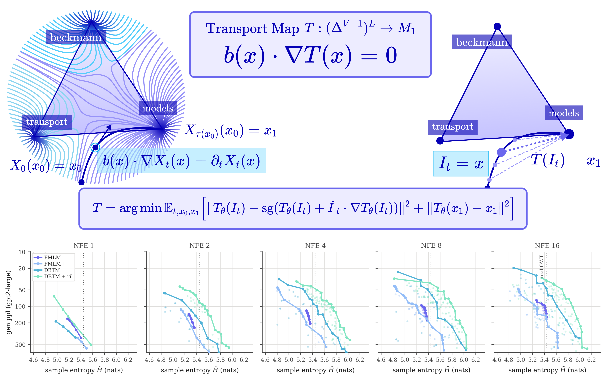

# Discrete Beckmann Transport Models for One-Step Language Modeling and Reasoning

[**Sophia Tang**](https://sophtang.github.io/) and [**Shiyi Wang**]()

  
  

This is the repository for the paper [**Discrete Beckmann Transport Models for One-Step Language Modeling and Reasoning**](https://arxiv.org/abs/2609.15903) (implementation coming soon).
